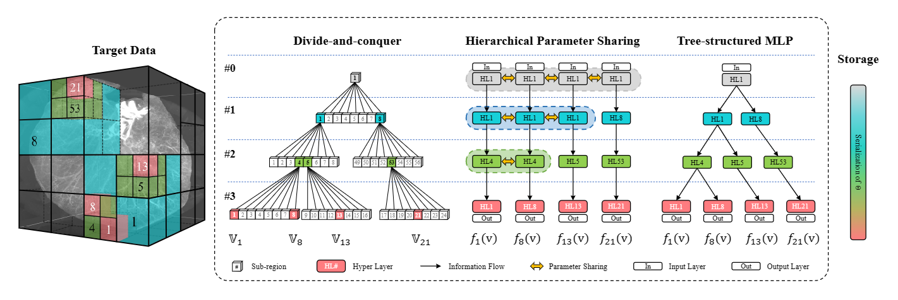
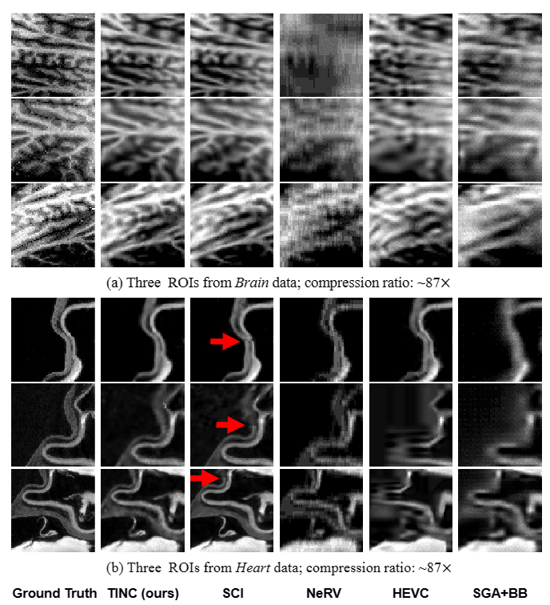

# 💾Tree-structured Implicit Neural Compression (TINC)

# 🚀Quickstart
The source codes are coming soon.
# 😘Citations

	@misc{yang2022tinc,

      title={TINC: Tree-structured Implicit Neural Compression}, 
      
      author={Runzhao Yang and Tingxiong Xiao and Yuxiao Cheng and Jinli Suo and Qionghai Dai},
      
      year={2022},
      
      eprint={2211.06689},
      
      archivePrefix={arXiv},
      
      primaryClass={cs.CV}
}
# 💡Contact
If you need any help or are looking for cooperation feel free to contact us.
yangrz20@mails.tsinghua.edu.cn
